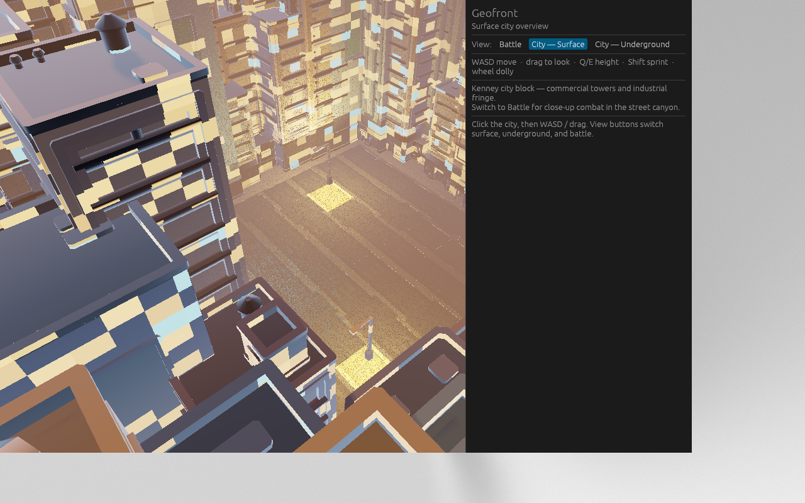
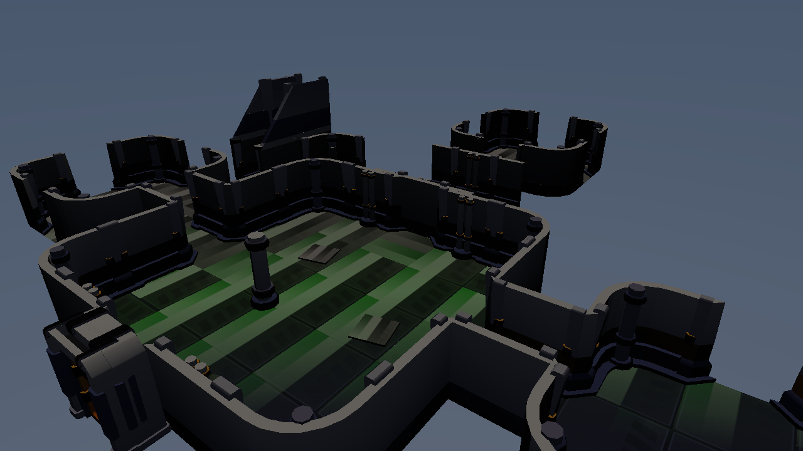
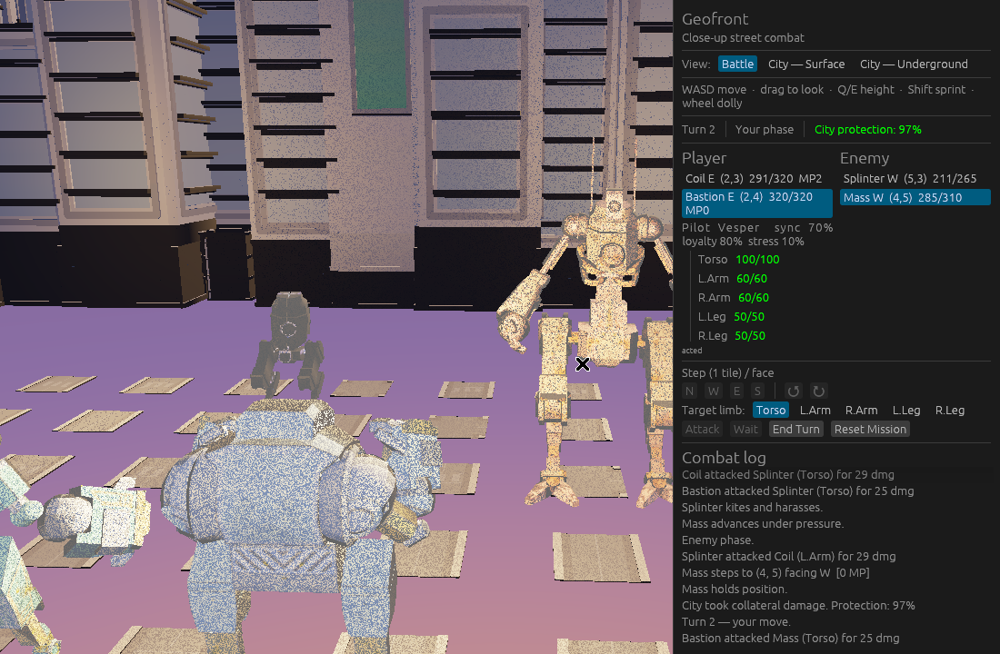

# Geofront

Mecha tactical city defence and management.

Hybrid of XCOM-style base management and *Into the Breach*-style focused mech combat, with strong emphasis on pilot psychology, synchronization, loyalty, and a single detailed living/destructible city.







## Status

- **Combat** — turn-based skirmish on an 8×8 street grid. Each unit gets move points (orthogonal steps) then one action (attack / wait). Facing, limb targeting, mobility/firepower from limbs, sequential enemy phase.
- **Presentation** — Quaternius skinned GLBs play Idle / Walk / Punch / Hit / Death via `Engine::set_animation`. Street lamps and hangar fixtures are raster point lights (cap reserved for attack flashes). Move tiles and facing drawn on the ground. Close-up camera with impact framing.
- **City** — Kenney surface block + Space Kit underground hangar (pieces abut on edges, no stacked floors).
- **HUD** — view switcher, N/W/E/S step, rotate, attack, wait, end turn (Blade + egui).
- **Dual target** — native + WASM (assets embedded via `include_dir` + Blade VFS; WASM uses Blade's WebGL2 backend). Pinned to Blade `56666fcd` (WebGL2 buffer-class + canvas color-space fixes).

See original design notes: https://github.com/kvark/ideas/blob/master/game/eva.md

## Setup

Shaders (required for the windowed build):

```bash
./scripts/fetch-shaders.sh
# or: cp -r ../redline/assets/shaders ./assets/shaders
```

## Run (native)

```bash
cargo run --release
```

Headless combat smoke test (no GPU / shaders required):

```bash
cargo run -- --smoke
```

Optional ray-traced lighting (needs RT hardware + RT shaders):

```bash
GEOFRONT_RT=1 cargo run --release
```

Capture a view and quit (used by `scripts/capture-screenshots.sh`):

```bash
GEOFRONT_VIEW=battle GEOFRONT_SCREENSHOT=screenshots/combat.png \
  GEOFRONT_QUIT_AFTER=8 cargo run --release
```

`GEOFRONT_VIEW` is `battle`, `surface`, or `underground`. `GEOFRONT_SCREENSHOT` (any value) implies an 8s quit if `GEOFRONT_QUIT_AFTER` is unset. Pair with Xvfb + `import` to write the PNG.

## Web / WASM

The web build **is** the game: same Rust crate, compiled to `wasm32-unknown-unknown`. Blade presents through **WebGL2** (not WebGPU).

```bash
rustup target add wasm32-unknown-unknown
bash scripts/build-web.sh
# serve dist/
```

GitHub Pages (`.github/workflows/pages.yml`) builds that WASM and deploys on push to `main`.

## Controls

| Input | Action |
|-------|--------|
| WASD / arrows | Fly camera |
| Drag | Look |
| Q / E | Up / down |
| Shift | Sprint |
| Wheel | Dolly |
| HUD N/W/E/S | Step selected mech one tile |
| ↺ ↻ | Face |
| Attack / Wait / End Turn | Action economy |

## Assets

- Kenney city kits (CC0) under `assets/models/{roads,commercial,industrial,space}`
- Quaternius Animated Mech Pack (CC0) as GLB under `assets/models/mechs/` (Stan, Mike, George, Leela)

## Core pillars

- One detailed city (protection funding, destructible, living)
- Few-unit close-up mech combat with limb/zonal damage + pilot disobedience risk
- Pilot–mech sync + interpersonal loyalty systems
- XCOM-like facilities, research, hangars under the city
